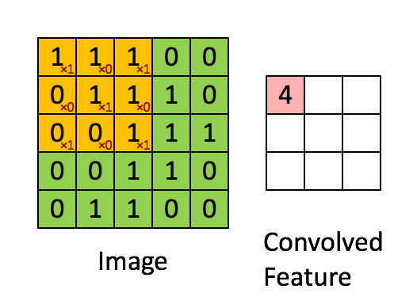

# The Foundation of PyTorch Deep Learning
# PyTorch深度学习基础

## Learning experience
## 学习心得

I didn't have a foundation for deep learning before I learned PyTorch, and no one has experience of it for more than two years (PyTorch released in 2017), so we all study together.  
由于我也才学PyTorch，之前也没有基础，再有基础也不会超过两年（2017发布），所以大家都是一起学习。

That said, those acquainted with or open rather than skeptical to deep learning still have an edge. The point from the previous article here is that those who have not studied statistics or machine learning could go forward with burdens discarded. Personally, it is not recommended to read books on traditional machine learning method such as watermelon books first, just start with deep learning, and it's not late looking through these books for inspiration unitl it is difficult for you to break through.  
话虽如此，但是懂深度学习套路的，持开放而非怀疑态度的人还是很占优势的。引用上一篇的观点就是没学过统计、机器学习的就没有包袱，轻装上路。不推荐先阅读西瓜书等传统方法类书籍，先从深度学习入手，后期因为难以突破再翻看传统方法寻找灵感也来得及。

Here I recommend [`Dive into Deep Learning` (PyTorch)](https://tangshusen.me/Dive-into-DL-PyTorch), and there are many other implemetations with different architectures, we can read them in contrast way.  
书籍只推荐[《动手学深度学习》(PyTorch版)](https://tangshusen.me/Dive-into-DL-PyTorch)，虽然有点挖墙脚，但是学有余力可以与MXNet对照，同时掌握两个框架。

As for my opinion on Tensorflow, I tried to learn the 1.x version, which has many functions and successfully dissuaded me. Although it's much more powerful than Pytorch, my suggestion is that don't try it first for your limited energy.  
至于我对Tensorflow的看法：曾经试着学习1.x版本，功能繁多，成功将我劝退。尽管确实要比PyTorch强大，然而精力有限，还是先别试了。


## 示例
## Examples

The following is an example of convolution  
以下为卷积示例


```python
>>> import torch
>>> import torch.nn.functional as F
>>> data=torch.Tensor([[1, 1, 1, 0, 0], [0, 1, 1, 1, 0], [0, 0, 1, 1, 1], [0, 0, 1, 1, 0], [0, 1, 1, 0, 0]]).unsqueeze_(0).unsqueeze_(0)
>>> data
tensor([[[[1., 1., 1., 0., 0.],
          [0., 1., 1., 1., 0.],
          [0., 0., 1., 1., 1.],
          [0., 0., 1., 1., 0.],
          [0., 1., 1., 0., 0.]]]])
>>> kernel=torch.Tensor([[1, 0, 1], [0, 1, 0], [1, 0, 1]]).unsqueeze_(0).unsqueeze_(0)
>>> kernel
tensor([[[[1., 0., 1.],
          [0., 1., 0.],
          [1., 0., 1.]]]])
>>> F.conv2d(data, kernel)
tensor([[[[4., 3., 4.],
          [2., 4., 3.],
          [2., 3., 4.]]]])
```


```python
>>> import torch
>>> import torch.nn.functional as F
>>> data=torch.Tensor([
    [[0, 1, 1, 2, 2], [0, 1, 1, 0, 0], [1, 1, 0, 1, 0], [1, 0, 1, 1, 1], [0, 2, 0, 1, 0]],
    [[1, 1, 1, 2, 0], [0, 2, 1, 1, 2], [1, 2, 0, 0, 2], [0, 2, 1, 2, 1], [2, 0, 1, 2, 0]],
    [[2, 0, 2, 0, 2], [0, 0, 1, 2, 1], [1, 0, 2, 2, 1], [2, 0, 2, 0, 0], [0, 0, 1, 1, 2]],
]).unsqueeze_(0)
>>> kernel=torch.Tensor([
    [[[1, 1, -1], [-1, 0, 1], [-1, -1, 0]],
     [[-1, 0, -1], [0, 0, -1], [1, -1, 0]],
     [[0, 1, 0], [1, 0, 1], [0, -1, 1]],],
    [[[-1, -1, 0], [-1, 1, 0], [-1, 1, 0]],
     [[1, -1, 0], [-1, 0, -1], [-1, 0, 0]],
     [[-1, 0, 1], [1, 0, 1], [0, -1, 0]],],
])
>>> F.conv2d(data, kernel, stride=2, padding=1,bias=torch.Tensor([1,0]))
tensor([[[[ 1.,  0., -3.],
          [-6.,  1.,  1.],
          [ 4., -3.,  1.]],

         [[-1., -6., -4.],
          [-2., -3., -4.],
          [-1., -3., -3.]]]])
```

``` python
>>> class LayerDemo:
    def __init__(self, *args, **kwargs):
        """make the class name "LayerDemo" like a function"""
        print("called: __init__", "args:", args, "kwargs", kwargs)
    def __call__(self, *args, **kwargs):
        """make an instance of the class "LayerDemo" like a function"""
        print("called: __call__", "args:", args, "kwargs", kwargs)
        return self.forward(*args, **kwargs)
    def forward(self, *args, **kwargs):
        print("called: forward", "args:", args, "kwargs", kwargs)
        return str(args) + str(kwargs)
>>> n = LayerDemo(a=1,b=2)
called: __init__ args: () kwargs {'a': 1, 'b': 2}
>>> n(c=(3,1), d='linear')
called: __call__ args: () kwargs {'c': (3, 1), 'd': 'linear'}
called: forward args: () kwargs {'c': (3, 1), 'd': 'linear'}
>>> n(["as", 12], 12, c='linear')
called: __call__ args: (['as', 12], 12) kwargs {'c': 'linear'}
called: forward args: (['as', 12], 12) kwargs {'c': 'linear'}

# so now we can derive
>>> class Layers(LayerDemo):
    def __init__(self, *args, **kwargs):
        """make the class name "LayerDemo" like a function"""
        super().__init__(*args, **kwargs)
        self.layer1 = LayerDemo('name1')
        self.layer2 = LayerDemo('name2')
    def forward(self, input):
        print("called: forward", "input:", input)
        x = self.layer1(input)
        x = self.layer1(x)
        return x
>>> m = Layers(1, 's')
called: __init__ args: (1, 's') kwargs {}
called: __init__ args: ('name1',) kwargs {}
called: __init__ args: ('name2',) kwargs {}
>>> m('qwerty')
called: __call__ args: ('qwerty',) kwargs {}
called: forward input: qwerty
called: __call__ args: ('qwerty',) kwargs {}
called: forward args: ('qwerty',) kwargs {}
called: __call__ args: ("('qwerty',){}",) kwargs {}
called: forward args: ("('qwerty',){}",) kwargs {}
'("(\'qwerty\',){}",){}'
```